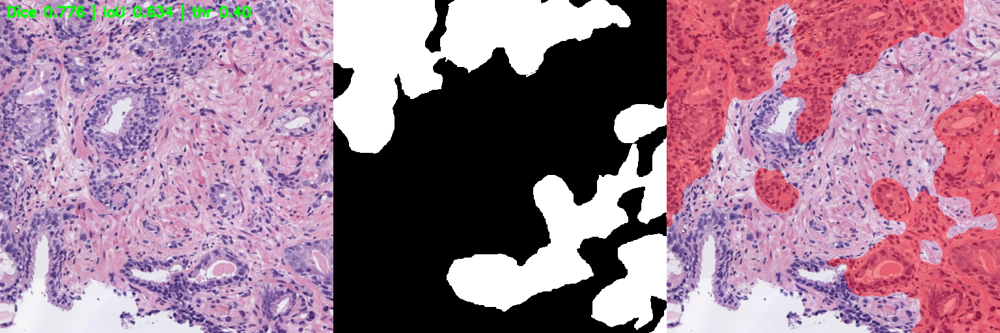
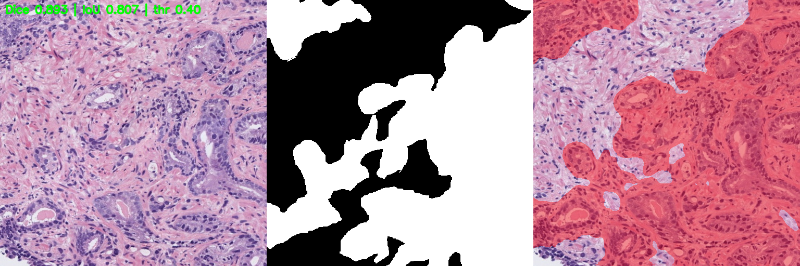
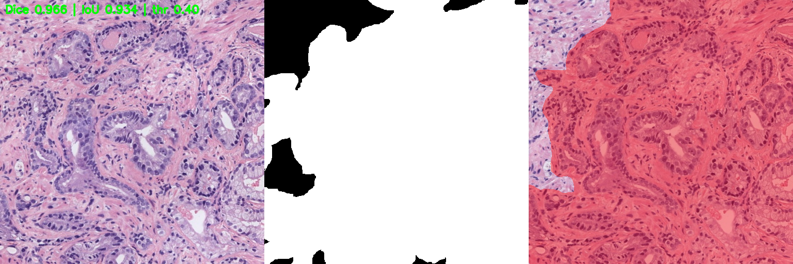
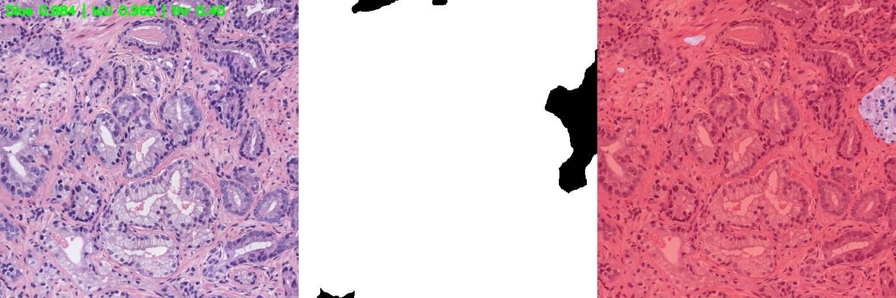
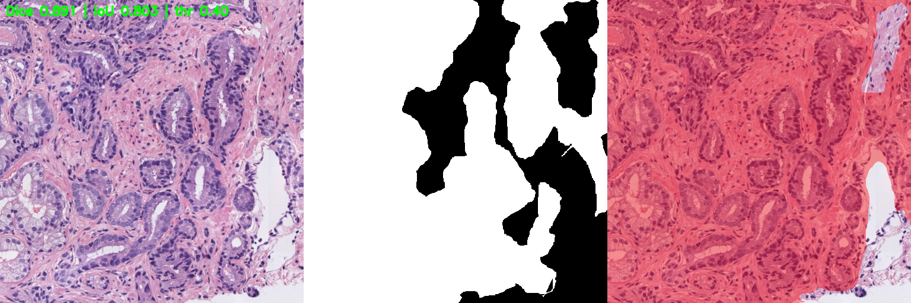

# Prostate Cancer Segmentation – SICAPv2 Dataset

## Overview
This project explores **gland segmentation** in prostate cancer histopathology images from the [SICAPv2 dataset](https://www.kaggle.com/datasets/shridharspol/sicapv2).  
Two segmentation approaches are implemented and compared:
1. **Watershed-based segmentation** (with CLAHE preprocessing)
2. **Deep learning-based segmentation** using **ResNet34+UNet** (PyTorch + segmentation_models_pytorch)

The aim was to evaluate a classical computer vision method against a modern CNN-based segmentation model.

---

## Dataset
- **Name:** SICAPv2 – Prostate Cancer Histopathology
- **Source:** [Kaggle Mirror SICAPv2](https://www.kaggle.com/datasets/shridharspol/sicapv2)
- **Contents:**
  - High-resolution H&E-stained histopathology images.
  - Binary segmentation masks for gland regions.
- **Split Used:**
  - Train, Validation, and Test sets as provided in the original dataset structure.

---

## Methods

### 1. **Classical: CLAHE + Multi-variant Watershed**
- **Preprocessing:**  
  - CLAHE (Contrast Limited Adaptive Histogram Equalization) for contrast enhancement.  
  - Morphological operations to clean noise.
- **Segmentation:**  
  - Watershed algorithm for boundary-based segmentation.

**Motivation:**  
To establish a baseline using a fast, unsupervised, and classical approach for comparison with a deep learning method.

---

### 2. **Deep Learning: ResNet34 + UNet**
- **Framework:** PyTorch
- **Architecture:**  
  - UNet decoder with ResNet34 encoder (ImageNet pretrained weights).  
  - Implemented via [`segmentation_models_pytorch`](https://github.com/qubvel/segmentation_models.pytorch).
- **Training Setup:**  
  - Image size: 512×512  
  - Batch size: 8  
  - Loss: Dice + BCE  
  - Optimizer: Adam  
  - Early stopping on validation loss.

**Motivation:**  
ResNet34+UNet is a proven architecture for biomedical segmentation, combining the skip connections of UNet with the feature extraction capability of ResNet encoders.

---

## Results

### **Watershed (CLAHE + multi-variant)**
| Set   | IoU    | Dice   | Precision | Recall  | BF1@2px |
|-------|--------|--------|-----------|---------|---------|
| Train | 0.0183 | 0.0271 | 0.0773    | 0.0259  | 0.0160  |
| Val   | 0.0092 | 0.0178 | 0.1334    | 0.0115  | 0.0270  |

> **Observation:** The watershed method struggled to segment gland structures accurately, especially in challenging histopathology textures.

---

### **ResNet34+UNet – Single Threshold (thr = 0.400)**
| Metric Type   | Dice   | IoU    | Precision | Recall  |
|---------------|--------|--------|-----------|---------|
| **Macro**     | 0.4702 | 0.3492 | 0.5436    | 0.4643  |
| **Positives** | 0.5290 | 0.3929 | 0.6116    | 0.5224  |
| **Micro**     | 0.6240 | 0.4535 | 0.6690    | 0.5847  |

---

### **ResNet34+UNet – Threshold Sweep**
| Condition                         | Dice   | IoU    | Precision | Recall  |
|------------------------------------|--------|--------|-----------|---------|
| **Best Micro Dice (thr=0.600)**    | 0.8860 | 0.7953 | 0.8655    | 0.9075  |
| **Best Precision (thr=0.950)**     | 0.5617 | —      | 0.9858    | 0.3927  |
| **Best Recall (thr=0.050)**        | 0.7920 | —      | 0.6589    | 0.9925  |

---

## Why Different Thresholds Matter
- **Single Threshold:**  
  - In real deployment, one threshold is chosen to balance false positives and false negatives.
  - Often set using validation data based on clinical or operational requirements.
- **Threshold Sweep:**  
  - Demonstrates the trade-off between **precision** and **recall**.  
  - Useful for **medical imaging** where:
    - **High Recall** → Minimize missed detections (screening phase).
    - **High Precision** → Reduce false positives (confirmation phase).
  - Shows robustness across operating points.

---

## Key Takeaways
- The **Watershed method** underperformed, confirming that classical CV approaches are insufficient for complex gland segmentation in prostate histopathology.
- **ResNet34+UNet** significantly outperformed Watershed in all metrics.
- Threshold sweeping provided insight into different operational trade-offs, which is important in clinical AI deployments.

---

## References

1. Ronneberger O., Fischer P., Brox T. **U-Net: Convolutional Networks for Biomedical Image Segmentation**. *Medical Image Computing and Computer-Assisted Intervention (MICCAI)*, 2015. [arXiv:1505.04597](https://arxiv.org/abs/1505.04597)

2. Shvets A.A., Rakhlin A., Kalinin A.A., Iglovikov V.I. **Automatic Instrument Segmentation in Robot-Assisted Surgery Using Deep Learning**. *2018 17th IEEE International Conference on Mathematical Methods in Electromagnetic Theory (MMET)*. [ar5iv link](https://ar5iv.org/html/1805.08573)  
   *(Introduces AlbuNet-34: U-Net with ResNet-34 encoder)*

3. **Segmentation Models PyTorch** – High-level API for training segmentation networks. [GitHub Repository](https://github.com/qubvel/segmentation_models.pytorch)

4. López-García G., Ramírez S., Valencia E., et al. **SICAPv2: A Comprehensive Prostate Biopsy Dataset for Automatic Gleason Grading**. *Mendeley Data*, V2, 2020. [DOI:10.17632/ks7j53bhxg.2](https://data.mendeley.com/datasets/ks7j53bhxg/2)  
   Also described in: *Computerized Medical Imaging and Graphics*, Volume 88, 2021. [ScienceDirect Link](https://www.sciencedirect.com/science/article/abs/pii/S0895611120302034)

5. Beucher S., Lantuéjoul C. **Use of Watersheds in Contour Detection**. *International Workshop on Image Processing: Real-time Edge and Motion Detection/Estimation*, 1979. World Scientific.  
   *(Classical watershed method applied in medical image analysis)*

---

## Sample Outputs

Below are sample predictions from the trained **ResNet34-U-Net** model on SICAPv2 histopathology patches.  

Each example shows:  
- **Left:** Original H&E-stained patch  
- **Middle:** Predicted segmentation mask  
- **Right:** Ground truth mask  
- **Metrics:** Dice score, IoU, and binarization threshold (top-left corner in green text)  

| Sample 1 | Sample 2 |
|----------|----------|
|  |  |

| Sample 3 | Sample 4 |
|----------|----------|
|  |  |

| Sample 5 |
|----------|
|  |

---

## How to Reproduce

1. **Download the Notebooks**  
   - `sicapv2-watershed-algorithm.ipynb` (Watershed baseline)  
   - `sicapv2-segmentation-resnet34-unet.ipynb` (U-Net with ResNet-34 encoder)  
   - `resnet34-unet-segmentation-evaluation.ipynb` (Evaluation and metrics sweep)

2. **Open in Kaggle**  
   - Create a new Kaggle Notebook.  
   - Upload the selected `.ipynb` file.

3. **Add Dataset**  
   - Add the **[SICAPv2 Mirror Dataset](https://www.kaggle.com/datasets/shridharspol/sicapv2)** as an input in the Kaggle Notebook settings.  
   - (Optional) For ResNet-34 U-Net, also add the saved model checkpoint folder if re-running only evaluation.

4. **Run All Cells**  
   - No extra dependencies need to be installed; all packages are available in Kaggle's default Python environment.  
   - Execution will produce segmentation results, evaluation metrics, and optional threshold-sweep plots.

**Tip:** If you only want to reproduce evaluation metrics, skip straight to the evaluation notebook, add the model checkpoint directory, and run.

